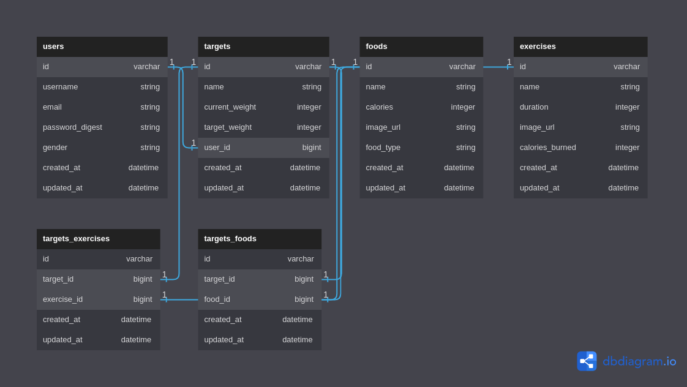

## GROUP PROJECT

## FITTRACK APP...
  Created,Developed and Modified by...
       1.KELLY MUGAMBI
       2.STELLA MARGY
       3.MORRIS WAITHAKA
       4.MARIAM ALI
       5.GLEN KIMANI

## WHAT IS FITRACK

Many people struggle to maintain a healthy lifestyle, especially when it comes to nutrition and exercise.
 
It can be difficult to make informed decisions about what to eat and how to exercise effectively. 

This full-stack project aims to address this problem by providing a comprehensive nutrition and exercise tracking application that utilizes a React frontend and a Rails backend.

This project will benefit individuals looking to improve their health and wellness, providing an easy-to-use tool for tracking and managing their nutrition and exercise habits.

FITTRACK will help you keep track of your day to day and daily habits of nutrition and maintain a healthy lifestyle.

## HOW IT CAME TO  BE

As stated above, many people find a really hard time to maintain a healthy lifestyle.
With our group members brilliant thinking and innovative minds we thought about this idea and it will help alot of people to keep track of their weight journey loss and their weight journey gain and also to observe the amount of food and intake of their calories that will help them become the best of their best shapes and forms

## ERD DIAGRAM

#### A user 

-has many :targets

#### Target:

 -belongs_to :user

 -has_many :target_foods

 -has_many :foods, through: :target_foods

 -has_many :target_exercises

 -has_many :exercises, through: :target_exercises

#### Food:

 -has_many :target_foods

 -has_many :targets, through: :target_foods

#### Exercise:

 -has_many :target_exercises

 -has_many :targets, through: :target_exercises

#### TargetsExercise:

  -belongs_to :target

  -belongs_to :exercise

#### TargetsFood

  -belongs_to :target

  -belongs_to :food

## HOW TO RUN THE APP
   Setup

Start by cloning (not forking) the project template repository and removing the remote:

$ git clone git@github.com:learn-co-curriculum/project-template-react-rails-api.git your-project-name
$ cd your-project-name
$ git remote rm origin

Then, create a new remote repository on GitHub. Head to github.com and click the + icon in the top-right corner and follow the steps to create a new repository. Important: don't check any of the options such as 'Add a README file', 'Add a .gitignore file', etc. — since you're importing an existing repository, creating any of those files on GitHub will cause issues.

If you're working with a partner, add them as a collaborator on GitHub. From your repo on GitHub, go to Settings > Manage Access > Invite a collaborator and enter your partner's username. Once your partner has access, they should git clone (not fork) the repository.

Finally, connect the GitHub remote repository to your local repository and push up your code:

$ git remote add origin git@github.com:your-username/your-project-name.git
$ git push -u origin main

When you're ready to start building your project, run:

bundle install
rails db:create
npm install --prefix client

You can use the following commands to run the application:

    rails s: run the backend on http://localhost:3000
    npm start --prefix client: run the frontend on http://localhost:4000

Before starting the app make sure you have the required installations

## HOW THE APP WORKS
The app works in this way...
When you finally open the app, you'll land on the landing page of the app where on you'll see the homepage where you will view the services available.
In order to register your name email and password so that you may be able to be recorded and become identified as a user.
Next you need to login with your username and password do that you'll be directed in the dashboard where you can view your target weight and your target weight and the food required to eat and consume
You can edit your food and also your specfic weight

## FINAL REMARKS
This is a very important project for people who don't know where to start in their weight loss and weight gain journey

[def]: ../client/src/images/FitTrack.png